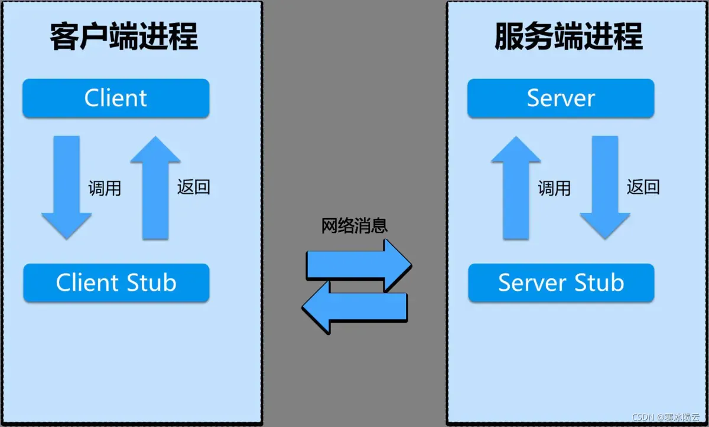

# RPC

[TOC]

学习本次课程需要对Go语言有一定的了解，推荐Google官方的Go教程 [A Tour of Go](https://tour.golang.org/list)

## 线程

多个线程允许一个程序同时进行多项任务，每个线程内部程序串行运行，并且有自己的**程序计数器、寄存器和栈空间**。

### 使用线程的优点
多线程的应用在分布式系统中非常常见，因为它能够支持并发操作，非常契合分布式系统的特点。

- I/O concurrency
  – 使用线程可以同时处理大量的I/O任务。一种常见的场景是，client构建多个线程来向不同的server发起rpc请求，每个请求线程得到响应后再执行对应的处理任务。
- Multicore performance
  – 使用多线程可以最大限度的利用多核CPU的性能。多个线程可以由不同的CPU核心进行处理，不同CPU核心的线程拥有独立的CPU周期。
- Convenience
  – 很多时候多线程可以大大简化我们的编程难度。比如在分布式系统中，我们想要每隔一定的时间进行一次事件检查（如 MapReduce中Master节点检查Worker是否异常），我们就可以创建一个线程，让其专门负责定期检查Worker是否存活。

### [事件驱动编程](https://www.jianshu.com/p/d4e591465ef3)

如果要实现并发I/O，除了采取多线程的方式，还可以采用事件驱动编程的思想来实现，如epoll模型等。在事件驱动编程中，有一个线程会负责循环检测所有的事件状态(或者请求存入事件队列)，如客户端发起的rpc请求等，当该线程检测到事件到来时，如服务器响应rpc请求，该线程就会调用相应的处理函数，并继续进行循环监听。事件驱动编程相比多线程的实现方式有以下不同：

- 优点
  – 开销更小（多线程的创建和删除以及空间占用远大于事件驱动）
- 缺点
  – 无法充分利用多核CPU的性能
  – 实现较为复杂

### 线程中的挑战

在进行多线程编程时，通常需要仔细考虑以下几个重要问题。

- shared data
  – 线程间是可以共享进程数据的，但是在使用共享数据的过程中，很可能会出现冲突问题。如两个线程同时执行`n=n+1`，由于读写的先后顺序不一致，程序产生的结果也会不一样。
- coordination
  – 我们经常需要线程间能够相互协作，比如经典的消费者-生产者模型。在Go语言中，线程间的相互协作通常有以下几种实现方式，`channel`，`sync.Cond`和`sync.WaitGroup`。
- deadlock
  

## Example: Web Crawler

下面用一个简单的网页爬虫来展示`Go`中多线程的应用，对于一个网页爬虫，我们需要其从给定的`url`出发不断递归查询，并且每个`url`只能爬取一次。我们首先先给出基本的数据结构。

```go
//
// main
//

func main() {
	fmt.Printf("=== Serial===\n")
	Serial("http://golang.org/", fetcher, make(map[string]bool))

	fmt.Printf("=== ConcurrentMutex ===\n")
	ConcurrentMutex("http://golang.org/", fetcher, makeState())

	fmt.Printf("=== ConcurrentChannel ===\n")
	ConcurrentChannel("http://golang.org/", fetcher)
}

//
// Fetcher
// 接口
// Fetcher接口定义了满足该接口类型必须实现的方法集合{Fetch(url string) (urls []string, err error)}
type Fetcher interface {
	// Fetch returns a slice of URLs found on the page.
	Fetch(url string) (urls []string, err error)
}

// fakeFetcher is Fetcher that returns canned results.
type fakeFetcher map[string]*fakeResult

type fakeResult struct {
	body string
	urls []string
}

// fakeFatcher实现了Fetcher接口
func (f fakeFetcher) Fetch(url string) ([]string, error) {
	if res, ok := f[url]; ok {
		fmt.Printf("found:   %s\n", url)
		return res.urls, nil
	}
	fmt.Printf("missing: %s\n", url)
	return nil, fmt.Errorf("not found: %s", url)
}

// fetcher is a populated fakeFetcher.
var fetcher = fakeFetcher{
	"http://golang.org/": &fakeResult{
		"The Go Programming Language",
		[]string{
			"http://golang.org/pkg/",
			"http://golang.org/cmd/",
		},
	},
	"http://golang.org/pkg/": &fakeResult{
		"Packages",
		[]string{
			"http://golang.org/",
			"http://golang.org/cmd/",
			"http://golang.org/pkg/fmt/",
			"http://golang.org/pkg/os/",
		},
	},
	"http://golang.org/pkg/fmt/": &fakeResult{
		"Package fmt",
		[]string{
			"http://golang.org/",
			"http://golang.org/pkg/",
		},
	},
	"http://golang.org/pkg/os/": &fakeResult{
		"Package os",
		[]string{
			"http://golang.org/",
			"http://golang.org/pkg/",
		},
	},
}

```

`fakeFetcher`是一个网页爬虫器，其实现了`Fetcher接口`，其会根据给出的`url`找到对应的结果。爬虫的结构被存储到`fakeResult`中。

### 串行 Serial crawler

```go
//
// Serial crawler
//

func Serial(url string, fetcher Fetcher, fetched map[string]bool) {
	if fetched[url] {
		return
	}
	fetched[url] = true
	urls, err := fetcher.Fetch(url)
	if err != nil {
		return
	}
	for _, u := range urls {
		Serial(u, fetcher, fetched) //map fetched是引用传递
        // go Serial(u, fetcher, fetched)  // 使用go rountine
	}
    return
}
```

在串行爬虫中，我们通过递归调用Serial函数来实现需求，但是这种方式一次只能爬一个网页，效率很低。

如果使用`go Serial()`，在第一个Serial退出后，routine仍然在运行并继续爬取。但是到16行继续生成爬虫Serial子程序并运行到自己的routine后，当前的Serial下一步就return退出，也就是并没有达到并发提速的效果

### ConcurrentMutex crawler(共享数据+锁)

我们使用`shared data + WaitGroup`的方式来实现并发爬虫。

```go
 //
// Concurrent crawler with shared state and Mutex
//

type fetchState struct {
	mu      sync.Mutex	// 这里并不意味着mu.Lock了其他goroutine就无法访问结构体中的map了,这个mu并不锁住整个struct
	fetched map[string]bool
}
// ConcurrentMutex("http://golang.org/", fetcher, makeState())
func ConcurrentMutex(url string, fetcher Fetcher, f *fetchState) {
	f.mu.Lock() //每次只有一个线程访问fetched map,防止两个Goroutine抓取了同一个Url
	already := f.fetched[url] // 所有爬虫线程共用此表
	f.fetched[url] = true
	f.mu.Unlock()

	if already {
		return
	}

	urls, err := fetcher.Fetch(url)
	if err != nil {
		return
	}
    //Go自带数据结构，帮助协程协调执行
	var done sync.WaitGroup //内部有一个Counter
    
	for _, u := range urls {
		done.Add(1) // Counter+1
		go func(u string) {	// 创建新的爬虫Goroutine获取url  匿名函数
			defer done.Done() // Counter-1
			ConcurrentMutex(u, fetcher, f)
        }(u) // _,  u:=range urls  u是该匿名函数的入参
	}
  
	done.Wait() // 等待Counter归零 ，也即是等待最后一个goroutine结束
	return
}

func makeState() *fetchState {
	f := &fetchState{}
	f.fetched = make(map[string]bool)
	return f
}
```

相比串行版本，该版本进行了以下改变：

- 由于我们需要每个`goroutine`在执行`fetch`任务时保证`url`的唯一性，因此我们需要使用一个`map`来作为线程间的共享变量。
- 在`ConcurrentMutex`中，我们使用`sync.Mutex`来保证map结构的读写正确
- 使用`sync.WaitGroup`来同步等待创建的`gorountines`执行完毕后再退出函数。
- 在`go func`入口使用`defer done.Done()`，来确保即使`goroutinue`执行异常，也能正确的更新`WaitGroup`计数器
  

### ConcurrentChannel Crawler （channel）

```go
// worker 线程并不共享任何对象
func worker(url string, ch chan []string, fetcher Fetcher) {
	urls, err := fetcher.Fetch(url)
	if err != nil {
		ch <- []string{} //发生错误,channel中写入新的空string url数组
	} else {
		ch <- urls // 正常爬取, channel写入爬取到的string url数组
	}
}


// 仅由master创建爬取url的goroutine线程
func master(ch chan []string, fetcher Fetcher) {
	n := 1 // 因为在34行已经向ch里面写入了一个Url
	fetched := make(map[string]bool)
	for urls := range ch { // 读取管道中的url数组
		for _, u := range urls { // 读取数组中的url
			if fetched[u] == false {
				fetched[u] = true
				n += 1
				go worker(u, ch, fetcher) //创建worker goroutine 基于该url继续爬取
			}
		}
		n -= 1
		if n == 0 { // 等待最后一个goroutine结束
			break
		}
	}
}

func ConcurrentChannel(url string, fetcher Fetcher) {
	ch := make(chan []string)
	go func() {
		ch <- []string{url}
	}()
	master(ch, fetcher)
}
```

区别于没有使用`Mutex,WaitGroup`，这里用`channel`来实现功能：

- coordinator函数负责分配任务，worker负责执行任务
- coordinator从channel中循环读取数据，并使用变量n来记录分配的任务数量。
- worker将查询到的结果放入到channel中，并等待coordinator接收。
  

## RPC

`RPC`用于`client`与`server`进行远程通信的一种调用框架，其基本组成如下图所示。



`RPC`框架调用流程如下：

- `client`调用`server`上的函数`f(x,y)`
- `client stub`将调用的函数及相关参数进行打包，通过网络发送给`server`
- `server stub`接收到数据包后进行参数和函数解析，调用`server`中的方法`f(x,y)`
- `server`将函数调用解决通过`server stub`返回，返回过程与发送过程相同

### 异常处理

在进行`RPC`通信的时候，可能出现的异常情况是`client`在发送了`rpc request`之后，没有收到`server`的响应。对于这种异常错误，一般有以下几种处理机制。

#### At least once

`client`会一直等待`server`的回复，并不断的重复的发送请求，直到达到发送上限或受到服务器的应答。**可以发现，这种处理机制对读操作是可以正常运行的，但是对于写操作，需要`server`有处理重复写操作的能力**。比如有一个K/V数据库，我们要求使用`Put(10)`方法往银行账户上增长10块钱，如果`server`端没有处理重复写操作的能力，就会造成数据错误。

#### At most once

当发生异常时，`server`会检测重复的`rpc request`并且会返回之前运行的请求，而不是重新执行该请求。每个`client`在发送请求时，都会携带一个`XID`的唯一标识符，`XID`通常由随机数，IP和sequence number组合而成。

```go
  server:
    if seen[xid]:
      r = old[xid]
    else
      r = handler()
      old[xid] = r
      seen[xid] = true
```

如何确保`rpc`可以安全的丢弃重复的`rpc request`，具体的做法可以参考`TCP`的实现思路。

`Go`中的`rpc`框架采用的简化版的`at-most-once`做法：

- 使用的是`TCP`连接
- `client`不会发送重复的`request`
- `client`会返回错误，如果其没有受到`response`

#### Exactly once

比较难实现，目前通用的解决方案是重传+冗余检测+异常处理。

### Example KV

下面我们用一个简单的K/V数据库来学习如何用`Go`来实现`RPC`通信。该例子中的数据库包含两个功能，`put`和`get`，`put`操作支持`client`向`server`中插入一个任意的键值对数据，`get`操作支持`client`查询`server`中的数据。

```go
package main

import (
	"fmt"
	"log"
	"net"
	"net/rpc"
	"sync"
)

//
// Common RPC request/reply definitions
//

const (
	OK       = "OK"
	ErrNoKey = "ErrNoKey"
)

type Err string

type PutArgs struct {
	Key   string
	Value string
}

type PutReply struct {
	Err Err
}

type GetArgs struct {
	Key string
}

type GetReply struct {
	Err   Err
	Value string
}

//
// Client
//

func connect() *rpc.Client {
	client, err := rpc.Dial("tcp", ":56666")
	if err != nil {
		log.Fatal("dialing:", err)
	}
	return client
}

func get(key string) string {
	client := connect()
	args := GetArgs{"subject"}
	reply := GetReply{}
	err := client.Call("KV.Get", &args, &reply)
	if err != nil {
		log.Fatal("error:", err)
	}
	client.Close()
	return reply.Value
}

func put(key string, val string) {
	client := connect()
	args := PutArgs{"subject", "6.824"}
	reply := PutReply{}
	err := client.Call("KV.Put", &args, &reply)
	if err != nil {
		log.Fatal("error:", err)
	}
	client.Close()
}

//
// Server
//

type KV struct {
	mu   sync.Mutex
	data map[string]string
}

func server() {
	//new(T)会为类型为T的新项分配已置零的内存空间，并返回它的地址
	kv := new(KV) //kv= *KV malloc ...
	kv.data = map[string]string{}
	rpcs := rpc.NewServer()
	rpcs.Register(kv)
	l, e := net.Listen("tcp", ":56666")
	if e != nil {
		log.Fatal("listen error", e)
	}
	go func() {
		for {
			conn, err := l.Accept()
			if err == nil {
				go rpcs.ServeConn(conn)
			} else {
				break
			}
		}
		l.Close()
	}()
}

func (kv *KV) Get(args *GetArgs, reply *GetReply) error {
	kv.mu.Lock()
	defer kv.mu.Unlock()

	val, ok := kv.data[args.Key]
	if ok {
		reply.Err = OK
		reply.Value = val
	} else {
		reply.Err = ErrNoKey
		reply.Value = ""
	}
	return nil
}

func (kv *KV) Put(args *PutArgs, reply *PutReply) error {
	kv.mu.Lock()
	defer kv.mu.Unlock()

	kv.data[args.Key] = args.Value
	reply.Err = OK
	return nil
}

//
// main
//

func main() {
	server()

	put("subject", "6.824")
	fmt.Printf("Put(subject, 6.824) done\n")
	fmt.Printf("get(subject) -> %s\n", get("subject"))
}
```

### 代码分析

**通用数据结构**

- 定义`get`和`put`的请求格式和应答格式
- 定义K/V数据的基本格式，包括键值对和互斥锁

**`client`流程**

- `connect()`函数用于与`server`建立`tcp`连接。
- `get()`和`put()`函数相当于`client stubs`，用于打包请求数据
- `Call()`函数通知`RPC`准备发起请求。在本例中我们在`Call`之前，已经定义好了请求和应答的格式，`RPC`库会打包参数，发送请求，然后等待回复，收到回复后再根据回复格式解析参数。

**`server`流程**

- 创建一个基于`tcp`连接的`server`，并将`K/V`数据库注册到`RPC`库中
- `RPC`框架在收到请求后，会为新的请求启动一个`goroutine`。新线程会解析请求参数，并在已注册的服务中找到匹配的服务，调用对应的函数，打包执行结果写入`TCP`连接。
- `Get()`和`Put()`函数必须加锁，因为`RPC`会为每个请求都单独创建一个`goroutine`。